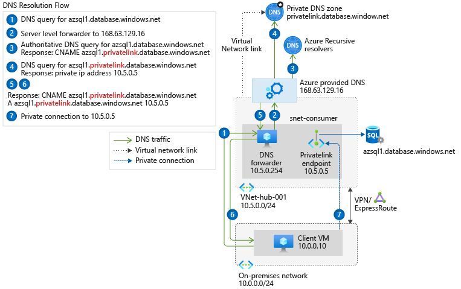

# azure-dns-forwarder
VNET内のプライベートIPアドレスの名前解決にAzurePrivateDNSZoneでレコード管理する場合、  
その名前解決はVNET内のリソースからのリクエストに限られます。  

この制限を回避するために、一旦VNET内のDNSフォワーダーでリクエストを受けて、  
そのリクエストをDNSフォワーダーからAzure DNSへ転送することで上記の問題に対処します。  



<br />

## 使用方法
Terraformのモジュールとして利用してください。

使用例
```hcl
module dnsserver {
  source              = "./modules/dns"
  resource_group_name = azurerm_resource_group.this.name
  vnet_subnet_id = azurerm_subnet.this.id
  ssh_key_path = "<Your sshkey path>"
  source_address_prefix = ["0.0.0.0/0"]
  private_ip_address = "<dnsserver's private ip address>"
  depends_on = [
    azurerm_resource_group.this,
  ]
}
```

<br />

参考  
- [Azure プライベート エンドポイントの DNS 構成](https://docs.microsoft.com/ja-jp/azure/private-link/private-endpoint-dns)  

- [whiteducksoftware/az-dns-forwarder](https://github.com/whiteducksoftware/az-dns-forwarder/blob/master/src/named.conf)  

- [Azure Virtual Network には DNS フォワーダーがあった方がいい](https://uncaughtexception.hatenablog.com/entry/2021/10/04/083000)
